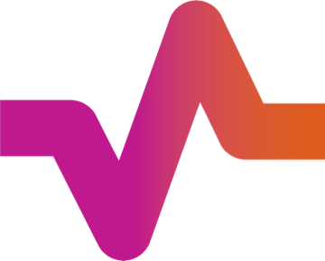

  

<h1 align="center">PULSE</h1>

  <strong>Aplicație pentru medici, cu funcționalități AI</strong>

  
  
  
  

---

PULSE este o aplicație gândită pentru medici, care aduce într-un singur loc articole, știri, cursuri și evenimente profesionale. Scopul aplicației este să ofere acces mai rapid la conținut relevant.

În plus, aplicația integrează două funcționalități AI principale:
- recomandări personalizate de conținut și evenimente
- rezumare rapidă a articolelor și răspunsuri scurte despre conținut

---

## 🧩 Problema

Medicii au acces la mult conținut util, dar acesta este adesea împrăștiat, greu de filtrat și dificil de parcurs rapid de pe telefon. Într-un ecosistem cu multe articole, reviste, cursuri și evenimente, utilizatorul pierde timp până găsește ceva relevant pentru specializarea și interesele lui.

---

## 💡 Soluția

PULSE mută experiența unui hub medical într-o aplicație rapidă, clară și personalizată.

Aplicația oferă:
- feed principal cu conținut medical relevant
- acces la articole, cursuri și evenimente
- profil profesional personalizabil
- recomandări AI bazate pe profil și activitate
- rezumat AI pentru articole

---

## 🎯 Obiectivele proiectului

- construire aplicație pentru acces rapid la conținut profesional
- personalizare în funcție de specializare și interese
- integrarea a agenților AI în produs
- realizarea unui demo funcțional cap-coadă
- documentarea procesului de dezvoltare software în repository

---

## ⚙️ Funcționalități principale

### Funcționalități de bază
- autentificare utilizator
- creare și editare profil
- selectarea specializării și intereselor
- vizualizare articole și știri
- vizualizare cursuri și evenimente
- căutare și filtrare
- salvare conținut relevant la favorite
- vizualizare profil și activitate recentă

### 🤖 Funcționalități AI

#### Agent AI 1 - Recomandări personalizate
Recomandă articole, cursuri și evenimente în funcție de:
- specializare
- interese selectate
- conținut vizualizat
- activitatea din aplicație

#### Agent AI 2 - Rezumare și răspuns rapid
Permite:
- generarea unui rezumat scurt pentru un articol
- evidențierea ideilor principale
- răspuns rapid la întrebări despre conținutul articolului

---

## 🗺️ User Journey

Fluxul principal al utilizatorului este:

> **Login → completare profil → feed principal → explorare conținut → deschidere articol → rezumat AI → recomandări personalizate → salvare conținut → revenire în profil**

---

### 🧠 AI
- integrare prin API pentru:
  - recomandări explicabile
  - rezumare articole
  - eventual clasificare/tagging de conținut
