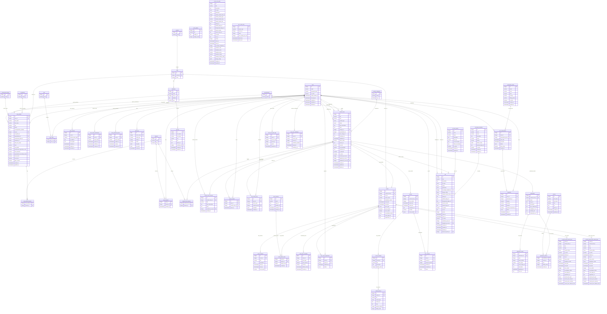

```mermaid
erDiagram
  %% =========================
  %% AUTH / USERS
  %% =========================

  users {
    integer id PK
    varchar email
    varchar password_hash
    boolean is_active
    timestamptz email_verified_at
    timestamptz last_login_at
    timestamptz created_at
    timestamptz updated_at
    timestamptz deleted_at
  }

  user_profiles {
    integer id PK
    integer user_id FK
    varchar first_name
    varchar last_name
    varchar cnp
    varchar phone
    text correspondence_address
    integer city_id FK
    integer occupation_id FK
    integer specialization_id FK
    integer professional_grade_id FK
    integer institution_id FK
    integer total_emc_points
    varchar cuim
    varchar cod_parafa
    varchar professional_registration_code
    varchar titlu_universitar
    varchar specialization_secondary_name
    boolean acord_email
    boolean acord_sms
    boolean gdpr_consent
    timestamptz created_at
    timestamptz updated_at
  }

  roles {
    integer id PK
    varchar name
  }

  user_roles {
    integer user_id FK
    integer role_id FK
  }

  user_sessions {
    integer id PK
    integer user_id FK
    varchar refresh_token_hash
    inet ip_address
    text user_agent
    timestamptz created_at
    timestamptz expires_at
    timestamptz revoked_at
  }

  user_email_verifications {
    integer id PK
    integer user_id FK
    varchar token_hash
    timestamptz expires_at
    timestamptz verified_at
    timestamptz created_at
  }

  user_password_resets {
    integer id PK
    integer user_id FK
    varchar token_hash
    timestamptz expires_at
    timestamptz used_at
    timestamptz created_at
  }

  audit_logs {
    bigint id PK
    integer actor_user_id FK
    varchar entity_type
    integer entity_id
    varchar action
    jsonb old_data
    jsonb new_data
    timestamptz created_at
  }

  users ||--o| user_profiles : has_profile
  users ||--o{ user_roles : assigned
  roles ||--o{ user_roles : contains
  users ||--o{ user_sessions : has_sessions
  users ||--o{ user_email_verifications : verifies_email
  users ||--o{ user_password_resets : resets_password
  users ||--o{ audit_logs : actor

  %% =========================
  %% NOMENCLATOARE / PROFILE LOOKUPS
  %% =========================

  counties {
    integer id PK
    varchar name
  }

  cities {
    integer id PK
    integer county_id FK
    varchar name
  }

  occupations {
    integer id PK
    varchar name
  }

  specializations {
    integer id PK
    varchar name
  }

  professional_grades {
    integer id PK
    varchar name
  }

  institutions {
    integer id PK
    varchar name
    integer city_id FK
    text address
    varchar type
  }

  interests {
    integer id PK
    varchar name
    varchar slug
  }

  user_profile_interests {
    integer user_profile_id FK
    integer interest_id FK
  }

  user_interests {
    integer user_id FK
    integer interest_id FK
    timestamptz created_at
  }

  counties ||--o{ cities : contains
  cities ||--o{ institutions : has
  cities ||--o{ user_profiles : profile_city
  occupations ||--o{ user_profiles : profile_occupation
  specializations ||--o{ user_profiles : profile_specialization
  professional_grades ||--o{ user_profiles : profile_grade
  institutions ||--o{ user_profiles : profile_institution
  user_profiles ||--o{ user_profile_interests : has
  interests ||--o{ user_profile_interests : selected
  users ||--o{ user_interests : has
  interests ||--o{ user_interests : selected

  %% =========================
  %% CONTENT CORE
  %% =========================

  content_categories {
    integer id PK
    varchar name
    varchar slug
  }

  content_items {
    integer id PK
    varchar title
    varchar slug
    enum content_type
    enum status
    text short_description
    text body
    integer category_id FK
    integer specialization_id FK
    text hero_image_url
    text thumbnail_url
    timestamptz published_at
    varchar author_name
    text source_url
    varchar seo_title
    varchar seo_description
    text canonical_url
    boolean is_featured
    boolean is_active
    integer created_by_user_id FK
    integer updated_by_user_id FK
    integer published_by_user_id FK
    timestamptz created_at
    timestamptz updated_at
    timestamptz deleted_at
  }

  content_item_interests {
    integer content_item_id FK
    integer interest_id FK
  }

  content_item_revisions {
    integer id PK
    integer content_item_id FK
    varchar title
    text short_description
    text body
    integer created_by_user_id FK
    timestamptz created_at
  }

  saved_content {
    integer id PK
    integer user_id FK
    integer content_item_id FK
    timestamptz saved_at
  }

  user_activity_logs {
    integer id PK
    integer user_id FK
    varchar action_type
    integer content_item_id FK
    jsonb metadata
    timestamptz created_at
  }

  content_categories ||--o{ content_items : categorizes
  specializations ||--o{ content_items : targets
  users ||--o{ content_items : created_by
  users ||--o{ content_items : updated_by
  users ||--o{ content_items : published_by
  content_items ||--o{ content_item_interests : tagged
  interests ||--o{ content_item_interests : interest
  content_items ||--o{ content_item_revisions : has_revisions
  users ||--o{ content_item_revisions : created_revision
  users ||--o{ saved_content : saves
  content_items ||--o{ saved_content : saved_item
  users ||--o{ user_activity_logs : performs
  content_items ||--o{ user_activity_logs : activity_on

  %% =========================
  %% AUTHORS / PERSONS
  %% =========================

  authors {
    integer id PK
    varchar first_name
    varchar last_name
    varchar title
    text bio
    text photo_url
    timestamptz created_at
    timestamptz updated_at
  }

  persons {
    integer id PK
    varchar first_name
    varchar last_name
    varchar title
    text bio
    text photo_url
    integer institution_id FK
    timestamptz created_at
    timestamptz updated_at
  }

  institutions ||--o{ persons : employs

  %% =========================
  %% EVENTS
  %% =========================

  events {
    integer id PK
    integer content_item_id FK
    integer city_id FK
    varchar venue_name
    enum attendance_mode
    timestamptz start_date
    timestamptz end_date
    enum price_type
    numeric price_amount
    integer emc_credits
    enum accreditation_status
    text event_page_url
    text registration_url
  }

  event_sessions {
    integer id PK
    integer event_id FK
    varchar title
    text description
    timestamptz starts_at
    timestamptz ends_at
    varchar room_name
  }

  event_gallery {
    integer id PK
    varchar title
    text image_url
    integer display_order
  }

  event_partners {
    integer id PK
    varchar name
    text logo_url
    text website_url
    timestamptz created_at
    timestamptz updated_at
  }

  event_partner_links {
    integer event_id FK
    integer partner_id FK
    integer display_order
    timestamptz created_at
  }

  event_price_schedule {
    bigint id PK
    integer event_id FK
    enum price_type
    numeric price_amount
    varchar currency
    timestamptz effective_from
    timestamptz created_at
  }

  user_event_registrations {
    integer id PK
    integer user_id FK
    integer event_id FK
    timestamptz registered_at
    enum status
  }

  content_items ||--o| events : event_details
  cities ||--o{ events : event_city
  events ||--o{ event_sessions : has_sessions
  events ||--o{ event_partner_links : has_partners
  event_partners ||--o{ event_partner_links : linked_to_event
  events ||--o{ event_price_schedule : scheduled_prices
  users ||--o{ user_event_registrations : registers
  events ||--o{ user_event_registrations : registrations

  %% event_gallery currently has no event_id in pasted schema

  %% =========================
  %% COURSES
  %% =========================

  courses {
    integer id PK
    integer content_item_id FK
    integer emc_credits
    timestamptz valid_from
    timestamptz valid_until
    text enrollment_url
    varchar provider
    enum course_status
  }

  course_modules {
    integer id PK
    integer course_id FK
    varchar title
    text description
    integer display_order
  }

  course_lessons {
    integer id PK
    integer module_id FK
    varchar title
    enum content_type
    text content_url
    text body
    integer duration_minutes
    integer display_order
  }

  user_courses {
    integer id PK
    integer user_id FK
    integer course_id FK
    integer progress_percent
    timestamptz enrolled_at
    timestamptz completed_at
    enum status
  }

  content_items ||--o| courses : course_details
  courses ||--o{ course_modules : has_modules
  course_modules ||--o{ course_lessons : has_lessons
  users ||--o{ user_courses : enrolls
  courses ||--o{ user_courses : enrollments

  %% =========================
  %% PUBLICATIONS
  %% =========================

  publications {
    integer id PK
    integer content_item_id FK
    varchar name
    text logo_url
    text description
    text emc_credits_text
    text creditation_text
    text indexing_text
    text subscription_url
  }

  publication_issues {
    integer id PK
    integer publication_id FK
    integer year
    integer issue_number
    varchar issue_label
    text cover_image_url
    text description
    timestamptz published_at
    text issue_url
  }

  publication_authors {
    integer publication_id FK
    integer author_id FK
    varchar role
    integer display_order
    timestamptz created_at
  }

  content_items ||--o| publications : publication_details
  publications ||--o{ publication_issues : has_issues
  publications ||--o{ publication_authors : has_authors
  authors ||--o{ publication_authors : writes

  %% =========================
  %% ADS
  %% =========================

  ads {
    integer id PK
    varchar title
    text description
    enum ad_type
    enum status
    enum placement
    integer ad_design_template_id FK
    jsonb design_config
    integer related_content_item_id FK
    text image_url
    text mobile_image_url
    text background_image_url
    varchar sponsor_name
    text sponsor_logo_url
    varchar cta_label
    text cta_url
    integer priority
    timestamptz starts_at
    timestamptz ends_at
    boolean is_active
    integer created_by_user_id FK
    integer updated_by_user_id FK
    timestamptz created_at
    timestamptz updated_at
    timestamptz deleted_at
    integer title_font_preset_id FK
  }

  ad_design_templates {
    integer id PK
    varchar code
    varchar name
    text description
    varchar layout
    varchar variant
    jsonb default_config
    text preview_image_url
    boolean is_active
    timestamptz created_at
    timestamptz updated_at
  }

  ad_font_presets {
    integer id PK
    varchar code
    varchar name
    text description
    varchar font_key
    text css_font_family
    text flutter_font_family
    boolean is_active
    timestamptz created_at
    timestamptz updated_at
  }

  active_ads_public {
    integer id
    varchar title
    text description
    enum ad_type
    enum placement
    integer related_content_item_id
    enum related_content_type
    varchar related_content_slug
    varchar related_content_title
    text image_url
    text mobile_image_url
    text background_image_url
    varchar sponsor_name
    text sponsor_logo_url
    varchar cta_label
    text cta_url
    integer priority
    timestamptz starts_at
    timestamptz ends_at
    integer ad_design_template_id
    varchar template_code
    varchar template_name
    varchar template_layout
    varchar template_variant
    jsonb template_default_config
    jsonb design_config
    timestamptz created_at
    timestamptz updated_at
  }

  ad_design_templates ||--o{ ads : template
  ad_font_presets ||--o{ ads : title_font
  content_items ||--o{ ads : related_content
  users ||--o{ ads : created_by
  users ||--o{ ads : updated_by

  %% active_ads_public is a public view over ads/templates/content

  %% =========================
  %% SUBSCRIPTIONS / PAYMENTS
  %% =========================

  subscription_plans {
    integer id PK
    varchar name
    varchar code
    numeric price
    varchar currency
    varchar billing_period
    boolean is_active
    timestamptz created_at
    timestamptz updated_at
  }

  user_subscriptions {
    integer id PK
    integer user_id FK
    integer subscription_plan_id FK
    timestamptz start_date
    timestamptz end_date
    enum status
    boolean auto_renew
    timestamptz created_at
  }

  payments {
    integer id PK
    integer user_id FK
    integer subscription_id FK
    numeric amount
    varchar currency
    varchar provider
    varchar provider_transaction_id
    enum status
    timestamptz paid_at
    timestamptz created_at
  }

  subscription_plans ||--o{ user_subscriptions : selected_plan
  users ||--o{ user_subscriptions : subscribes
  users ||--o{ payments : pays
  user_subscriptions ||--o{ payments : payment_for

  %% =========================
  %% EMC / RECOMMENDATIONS
  %% =========================

  emc_credit_rules {
    integer id PK
    varchar source_type
    integer source_id
    integer points
    integer max_awards_per_user
    timestamptz valid_from
    timestamptz valid_until
  }

  user_emc_point_logs {
    integer id PK
    integer user_id FK
    varchar source_type
    integer source_id
    integer points
    timestamptz awarded_at
  }

  user_emc_certificates {
    integer id PK
    integer user_id FK
    varchar source_type
    integer source_id
    varchar certificate_number
    timestamptz issued_at
    text certificate_url
  }

  users ||--o{ user_emc_point_logs : earns_points
  users ||--o{ user_emc_certificates : receives_certificates

  %% =========================
  %% PRICE VIEWS
  %% =========================

  v_events_with_current_price {
    integer event_id
    integer content_item_id
    varchar title
    varchar slug
    enum content_status
    boolean is_active
    timestamptz deleted_at
    integer city_id
    varchar venue_name
    enum attendance_mode
    timestamptz start_date
    timestamptz end_date
    integer emc_credits
    enum accreditation_status
    text event_page_url
    text registration_url
    enum current_price_type
    numeric current_price_amount
    varchar current_price_currency
    timestamptz current_price_effective_from
  }

  v_active_events_with_current_price {
    integer event_id
    integer content_item_id
    varchar title
    varchar slug
    enum content_status
    boolean is_active
    timestamptz deleted_at
    integer city_id
    varchar venue_name
    enum attendance_mode
    timestamptz start_date
    timestamptz end_date
    integer emc_credits
    enum accreditation_status
    text event_page_url
    text registration_url
    enum current_price_type
    numeric current_price_amount
    varchar current_price_currency
    timestamptz current_price_effective_from
  }

  events ||--o{ v_events_with_current_price : view_source
  events ||--o{ v_active_events_with_current_price : active_view_source
```
