# Diagrame UML — PULSE Medical Platform

> Toate diagramele de mai jos sunt generate pe baza specificațiilor din cele 5 PDF-uri ale cursului **Metode de Dezvoltare Software (MDS)** și reflectă structura reală a proiectului PULSE din codul sursă ([models.py](file:///home/stoici/miruna/PULSE/backend/models.py), [schemas.py](file:///home/stoici/miruna/PULSE/backend/schemas.py), [README.md](file:///home/stoici/miruna/PULSE/README.md)).

> [!NOTE]
> **Referințe PDF:**
> - **MDS-5** — Introducere UML, cele 14 tipuri de diagrame
> - **MDS-6** — Diagrame de cazuri de utilizare (actori, `«include»`, `«extend»`, generalizare)
> - **MDS-7** — Diagrame de clase (atribute, operații, asocieri, multiplicități, agregare, compunere, generalizare, interfețe, pachete)
> - **MDS-8** — Diagrame de secvențe (mesaje sincrone/asincrone, fragmente `opt`/`alt`/`loop`, creare/distrugere)
> - **MDS-9** — Diagrame de stări (stări, tranziții, evenimente/acțiuni, gărzi)

---

## 1. Diagrama de Cazuri de Utilizare (Use Case Diagram)

> **Ref MDS-6:** „Descriu comportamentul sistemului din punct de vedere al utilizatorului. Două părți principale: sistem (componente) și utilizatori (elemente externe)."

### 1.1 Cazuri de utilizare — Utilizator (Medic/Pacient)

> **Ref MDS-6:** Actorii sunt roluri jucate de utilizatori; un actor nu este un singur utilizator ci o clasă de utilizatori. Relația `«include»` arată secvențe comune reutilizate; `«extend»` separă scenarii excepționale.

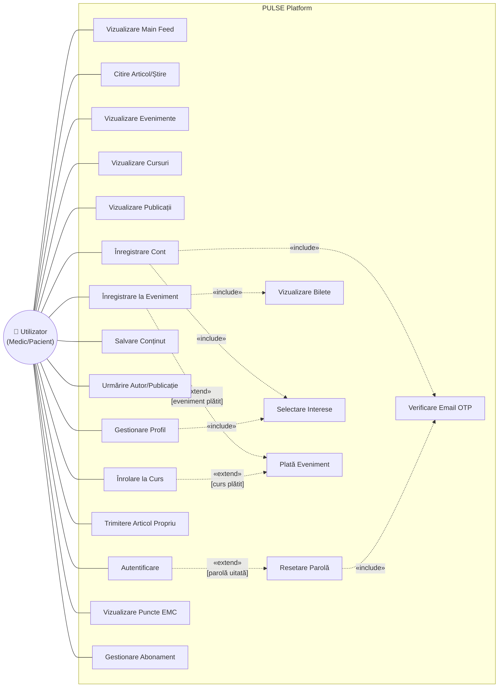
```mermaid
graph LR
    subgraph "PULSE Platform"
        UC1["Vizualizare Main Feed"]
        UC2["Citire Articol/Știre"]
        UC3["Vizualizare Evenimente"]
        UC4["Vizualizare Cursuri"]
        UC5["Vizualizare Publicații"]
        UC6["Înregistrare Cont"]
        UC7["Autentificare"]
        UC8["Verificare Email OTP"]
        UC9["Resetare Parolă"]
        UC10["Salvare Conținut"]
        UC11["Urmărire Autor/Publicație"]
        UC12["Înrolare la Curs"]
        UC13["Înregistrare la Eveniment"]
        UC14["Vizualizare Bilete"]
        UC15["Trimitere Articol Propriu"]
        UC16["Gestionare Profil"]
        UC17["Selectare Interese"]
        UC18["Vizualizare Puncte EMC"]
        UC19["Plată Eveniment"]
        UC20["Gestionare Abonament"]
    end

    U1(("👤 Utilizator\n(Medic/Pacient)"))

    U1 --- UC1
    U1 --- UC2
    U1 --- UC3
    U1 --- UC4
    U1 --- UC5
    U1 --- UC6
    U1 --- UC7
    U1 --- UC10
    U1 --- UC11
    U1 --- UC12
    U1 --- UC13
    U1 --- UC15
    U1 --- UC16
    U1 --- UC18
    U1 --- UC20

    UC6 -. "«include»" .-> UC8
    UC6 -. "«include»" .-> UC17
    UC9 -. "«include»" .-> UC8
    UC7 -. "«extend»\n[parolă uitată]" .-> UC9
    UC13 -. "«extend»\n[eveniment plătit]" .-> UC19
    UC13 -. "«include»" .-> UC14
    UC12 -. "«extend»\n[curs plătit]" .-> UC19
    UC16 -. "«include»" .-> UC17
```

### 1.2 Cazuri de utilizare — Administrator

> **Ref MDS-6:** „Același utilizator poate avea diferite roluri. Identificarea actorilor = identificarea rolurilor."

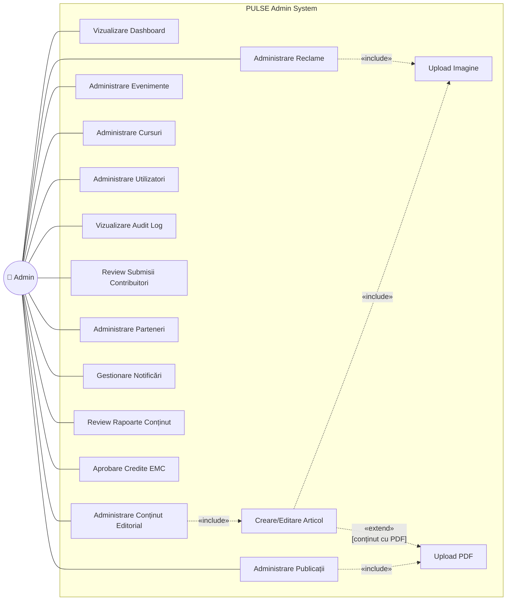
```mermaid
graph LR
    subgraph "PULSE Admin System"
        AUC1["Vizualizare Dashboard"]
        AUC2["Administrare Conținut Editorial"]
        AUC3["Creare/Editare Articol"]
        AUC4["Administrare Evenimente"]
        AUC5["Administrare Cursuri"]
        AUC6["Administrare Publicații"]
        AUC7["Administrare Reclame"]
        AUC8["Upload Imagine"]
        AUC9["Upload PDF"]
        AUC10["Administrare Utilizatori"]
        AUC11["Vizualizare Audit Log"]
        AUC12["Review Submisii Contribuitori"]
        AUC13["Administrare Parteneri"]
        AUC14["Gestionare Notificări"]
        AUC15["Review Rapoarte Conținut"]
        AUC16["Aprobare Credite EMC"]
    end

    A1(("🔑 Admin"))

    A1 --- AUC1
    A1 --- AUC2
    A1 --- AUC4
    A1 --- AUC5
    A1 --- AUC6
    A1 --- AUC7
    A1 --- AUC10
    A1 --- AUC11
    A1 --- AUC12
    A1 --- AUC13
    A1 --- AUC14
    A1 --- AUC15
    A1 --- AUC16

    AUC2 -. "«include»" .-> AUC3
    AUC3 -. "«include»" .-> AUC8
    AUC6 -. "«include»" .-> AUC9
    AUC7 -. "«include»" .-> AUC8
    AUC3 -. "«extend»\n[conținut cu PDF]" .-> AUC9
```

---

## 2. Diagrame de Clase (Class Diagrams)

> **Ref MDS-7:** „Diagramele de clase sunt folosite pentru a specifica structura statică a sistemului: ce clase există și care este legătura dintre ele." Clasele au atribute (cu vizibilitate `+`/`-`/`#`/`~`, tipuri, multiplicități) și operații. Relațiile includ: asociere (cu multiplicități), agregare (◇), compunere (◆), generalizare (▷), dependență (-->) și realizare (..▷).

### 2.1 Pachetul Core — Content Domain (Agregare, Compunere, Generalizare)

> **Ref MDS-7:** „Compunerea implică o apartenență puternică a părții la întreg și o coincidență între durata de viață." ContentItem *compune* Event/Course/Publication (cascade delete). „Generalizarea: relație între un lucru general și un lucru specializat."

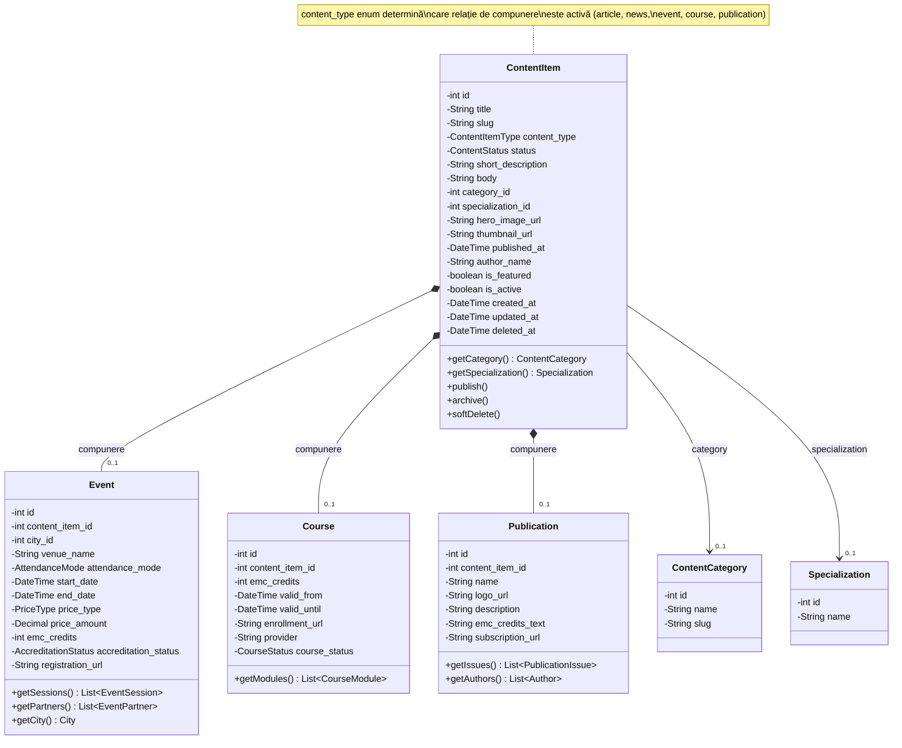
```mermaid
classDiagram
    class ContentItem {
        -int id
        -String title
        -String slug
        -ContentItemType content_type
        -ContentStatus status
        -String short_description
        -String body
        -int category_id
        -int specialization_id
        -String hero_image_url
        -String thumbnail_url
        -DateTime published_at
        -String author_name
        -boolean is_featured
        -boolean is_active
        -DateTime created_at
        -DateTime updated_at
        -DateTime deleted_at
        +getCategory() ContentCategory
        +getSpecialization() Specialization
        +publish()
        +archive()
        +softDelete()
    }

    class Event {
        -int id
        -int content_item_id
        -int city_id
        -String venue_name
        -AttendanceMode attendance_mode
        -DateTime start_date
        -DateTime end_date
        -PriceType price_type
        -Decimal price_amount
        -int emc_credits
        -AccreditationStatus accreditation_status
        -String registration_url
        +getSessions() List~EventSession~
        +getPartners() List~EventPartner~
        +getCity() City
    }

    class Course {
        -int id
        -int content_item_id
        -int emc_credits
        -DateTime valid_from
        -DateTime valid_until
        -String enrollment_url
        -String provider
        -CourseStatus course_status
        +getModules() List~CourseModule~
    }

    class Publication {
        -int id
        -int content_item_id
        -String name
        -String logo_url
        -String description
        -String emc_credits_text
        -String subscription_url
        +getIssues() List~PublicationIssue~
        +getAuthors() List~Author~
    }

    class ContentCategory {
        -int id
        -String name
        -String slug
    }

    class Specialization {
        -int id
        -String name
    }

    ContentItem *-- "0..1" Event : compunere
    ContentItem *-- "0..1" Course : compunere
    ContentItem *-- "0..1" Publication : compunere
    ContentItem --> "0..1" ContentCategory : category
    ContentItem --> "0..1" Specialization : specialization

    note for ContentItem "content_type enum determină\ncare relație de compunere\neste activă (article, news,\nevent, course, publication)"
```

### 2.2 Pachetul Events — Compunere și Agregare

> **Ref MDS-7:** „Agregarea este modul cel mai general de a indica o relație parte-întreg." Event *compune* EventSession (parte nu poate exista fără întreg). Event *agregă* EventPartner (partenerul există independent).

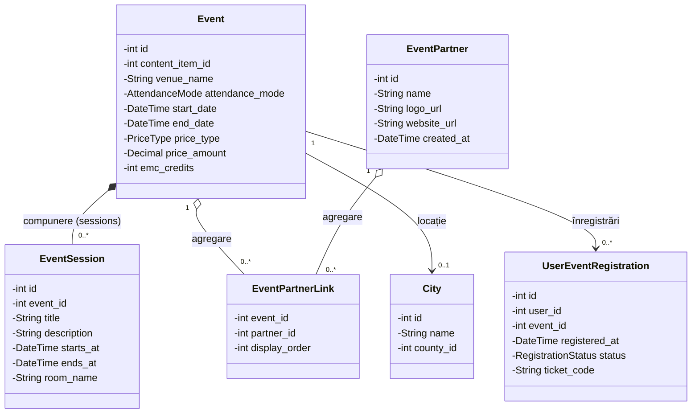
```mermaid
classDiagram
    class Event {
        -int id
        -int content_item_id
        -String venue_name
        -AttendanceMode attendance_mode
        -DateTime start_date
        -DateTime end_date
        -PriceType price_type
        -Decimal price_amount
        -int emc_credits
    }

    class EventSession {
        -int id
        -int event_id
        -String title
        -String description
        -DateTime starts_at
        -DateTime ends_at
        -String room_name
    }

    class EventPartner {
        -int id
        -String name
        -String logo_url
        -String website_url
        -DateTime created_at
    }

    class EventPartnerLink {
        -int event_id
        -int partner_id
        -int display_order
    }

    class UserEventRegistration {
        -int id
        -int user_id
        -int event_id
        -DateTime registered_at
        -RegistrationStatus status
        -String ticket_code
    }

    class City {
        -int id
        -String name
        -int county_id
    }

    Event *-- "0..*" EventSession : compunere (sessions)
    Event "1" o-- "0..*" EventPartnerLink : agregare
    EventPartner "1" o-- "0..*" EventPartnerLink : agregare
    Event --> "0..1" City : locație
    Event "1" --> "0..*" UserEventRegistration : înregistrări
```

### 2.3 Pachetul Courses — Ierarhie Compunere

> **Ref MDS-7:** „Dacă întregul este creat, mutat sau distrus, atunci și părțile componente sunt create, mutate sau distruse."

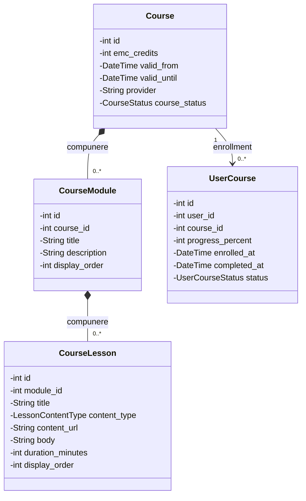
```mermaid
classDiagram
    class Course {
        -int id
        -int emc_credits
        -DateTime valid_from
        -DateTime valid_until
        -String provider
        -CourseStatus course_status
    }

    class CourseModule {
        -int id
        -int course_id
        -String title
        -String description
        -int display_order
    }

    class CourseLesson {
        -int id
        -int module_id
        -String title
        -LessonContentType content_type
        -String content_url
        -String body
        -int duration_minutes
        -int display_order
    }

    class UserCourse {
        -int id
        -int user_id
        -int course_id
        -int progress_percent
        -DateTime enrolled_at
        -DateTime completed_at
        -UserCourseStatus status
    }

    Course *-- "0..*" CourseModule : compunere
    CourseModule *-- "0..*" CourseLesson : compunere
    Course "1" --> "0..*" UserCourse : enrollment
```

### 2.4 Pachetul Users — Asocieri și Generalizare

> **Ref MDS-7:** „Asocierile sunt legături structurale între clase. Între două clase există o asociere atunci când un obiect interacționează cu un obiect din cealaltă clasă." „Multiplicități: un număr, un interval, sau * pentru arbitrar."

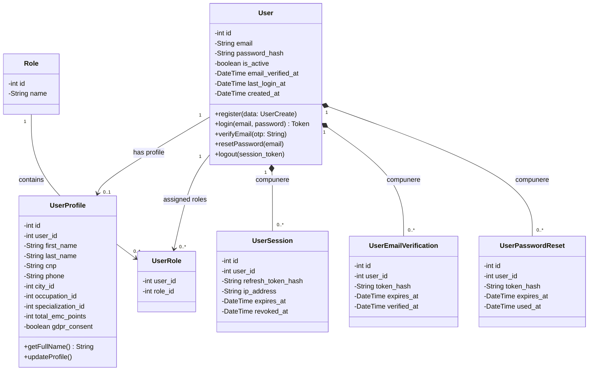
```mermaid
classDiagram
    class User {
        -int id
        -String email
        -String password_hash
        -boolean is_active
        -DateTime email_verified_at
        -DateTime last_login_at
        -DateTime created_at
        +register(data: UserCreate)
        +login(email, password) Token
        +verifyEmail(otp: String)
        +resetPassword(email)
        +logout(session_token)
    }

    class UserProfile {
        -int id
        -int user_id
        -String first_name
        -String last_name
        -String cnp
        -String phone
        -int city_id
        -int occupation_id
        -int specialization_id
        -int total_emc_points
        -boolean gdpr_consent
        +getFullName() String
        +updateProfile()
    }

    class Role {
        -int id
        -String name
    }

    class UserRole {
        -int user_id
        -int role_id
    }

    class UserSession {
        -int id
        -int user_id
        -String refresh_token_hash
        -String ip_address
        -DateTime expires_at
        -DateTime revoked_at
    }

    class UserEmailVerification {
        -int id
        -int user_id
        -String token_hash
        -DateTime expires_at
        -DateTime verified_at
    }

    class UserPasswordReset {
        -int id
        -int user_id
        -String token_hash
        -DateTime expires_at
        -DateTime used_at
    }

    User "1" --> "0..1" UserProfile : has profile
    User "1" --> "0..*" UserRole : assigned roles
    Role "1" --> "0..*" UserRole : contains
    User "1" *-- "0..*" UserSession : compunere
    User "1" *-- "0..*" UserEmailVerification : compunere
    User "1" *-- "0..*" UserPasswordReset : compunere
```

### 2.5 Pachetul Ads — Template Pattern

> **Ref MDS-7:** „Dependențe: clasa A depinde de clasa B dacă o modificare în specificația lui B poate produce modificarea lui A."

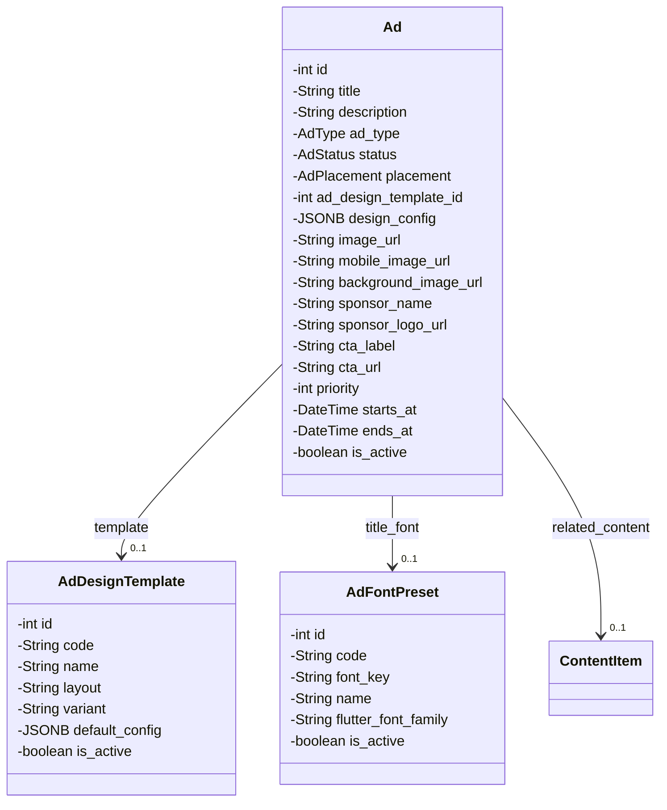
```mermaid
classDiagram
    class Ad {
        -int id
        -String title
        -String description
        -AdType ad_type
        -AdStatus status
        -AdPlacement placement
        -int ad_design_template_id
        -JSONB design_config
        -String image_url
        -String mobile_image_url
        -String background_image_url
        -String sponsor_name
        -String sponsor_logo_url
        -String cta_label
        -String cta_url
        -int priority
        -DateTime starts_at
        -DateTime ends_at
        -boolean is_active
    }

    class AdDesignTemplate {
        -int id
        -String code
        -String name
        -String layout
        -String variant
        -JSONB default_config
        -boolean is_active
    }

    class AdFontPreset {
        -int id
        -String code
        -String font_key
        -String name
        -String flutter_font_family
        -boolean is_active
    }

    Ad --> "0..1" AdDesignTemplate : template
    Ad --> "0..1" AdFontPreset : title_font
    Ad --> "0..1" ContentItem : related_content
```

### 2.6 Pachetul Subscriptions & Payments

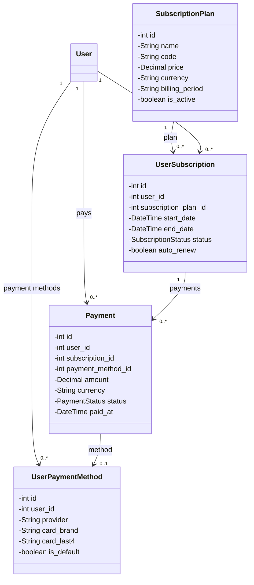
```mermaid
classDiagram
    class SubscriptionPlan {
        -int id
        -String name
        -String code
        -Decimal price
        -String currency
        -String billing_period
        -boolean is_active
    }

    class UserSubscription {
        -int id
        -int user_id
        -int subscription_plan_id
        -DateTime start_date
        -DateTime end_date
        -SubscriptionStatus status
        -boolean auto_renew
    }

    class UserPaymentMethod {
        -int id
        -int user_id
        -String provider
        -String card_brand
        -String card_last4
        -boolean is_default
    }

    class Payment {
        -int id
        -int user_id
        -int subscription_id
        -int payment_method_id
        -Decimal amount
        -String currency
        -PaymentStatus status
        -DateTime paid_at
    }

    SubscriptionPlan "1" --> "0..*" UserSubscription : plan
    User "1" --> "0..*" UserSubscription : subscribes
    User "1" --> "0..*" UserPaymentMethod : payment methods
    User "1" --> "0..*" Payment : pays
    UserSubscription "1" --> "0..*" Payment : payments
    Payment --> "0..1" UserPaymentMethod : method
```

### 2.7 Diagrama de Pachete (Package Diagram)

> **Ref MDS-7:** „Un mod de a organiza clasele este folosirea pachetelor. Grafic, un pachet este un dreptunghi cu numele în colțul din stânga-sus."

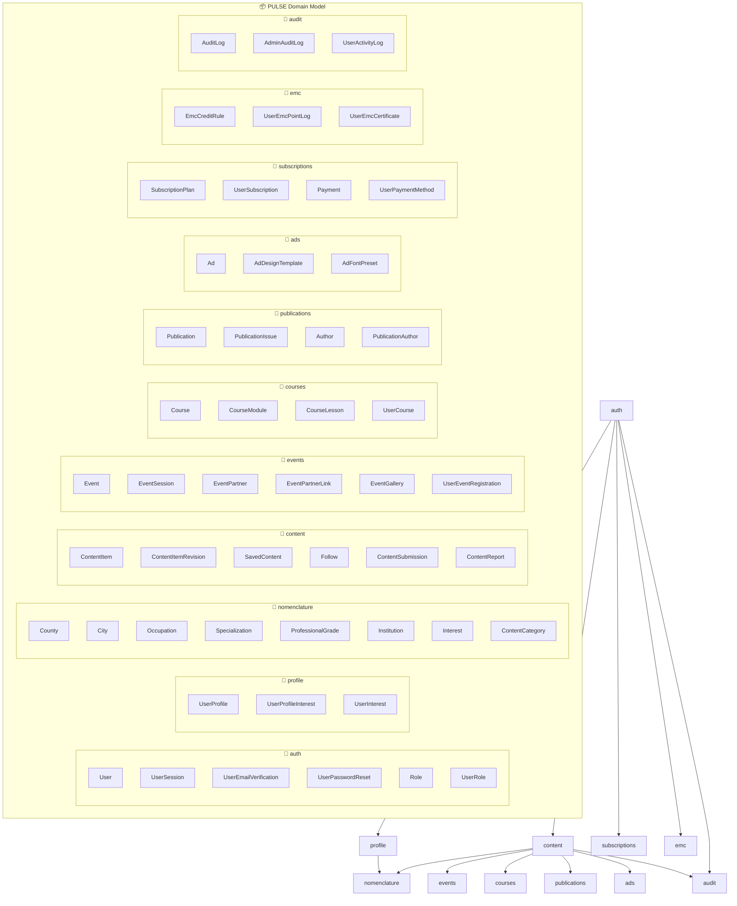
```mermaid
graph TB
    subgraph "📦 PULSE Domain Model"
        subgraph "📁 auth"
            A1[User]
            A2[UserSession]
            A3[UserEmailVerification]
            A4[UserPasswordReset]
            A5[Role]
            A6[UserRole]
        end

        subgraph "📁 profile"
            P1[UserProfile]
            P2[UserProfileInterest]
            P3[UserInterest]
        end

        subgraph "📁 nomenclature"
            N1[County]
            N2[City]
            N3[Occupation]
            N4[Specialization]
            N5[ProfessionalGrade]
            N6[Institution]
            N7[Interest]
            N8[ContentCategory]
        end

        subgraph "📁 content"
            C1[ContentItem]
            C2[ContentItemRevision]
            C3[SavedContent]
            C4[Follow]
            C5[ContentSubmission]
            C6[ContentReport]
        end

        subgraph "📁 events"
            E1[Event]
            E2[EventSession]
            E3[EventPartner]
            E4[EventPartnerLink]
            E5[EventGallery]
            E6[UserEventRegistration]
        end

        subgraph "📁 courses"
            CR1[Course]
            CR2[CourseModule]
            CR3[CourseLesson]
            CR4[UserCourse]
        end

        subgraph "📁 publications"
            PB1[Publication]
            PB2[PublicationIssue]
            PB3[Author]
            PB4[PublicationAuthor]
        end

        subgraph "📁 ads"
            AD1[Ad]
            AD2[AdDesignTemplate]
            AD3[AdFontPreset]
        end

        subgraph "📁 subscriptions"
            S1[SubscriptionPlan]
            S2[UserSubscription]
            S3[Payment]
            S4[UserPaymentMethod]
        end

        subgraph "📁 emc"
            EM1[EmcCreditRule]
            EM2[UserEmcPointLog]
            EM3[UserEmcCertificate]
        end

        subgraph "📁 audit"
            AU1[AuditLog]
            AU2[AdminAuditLog]
            AU3[UserActivityLog]
        end
    end

    auth --> profile
    auth --> content
    profile --> nomenclature
    content --> nomenclature
    content --> events
    content --> courses
    content --> publications
    content --> ads
    auth --> subscriptions
    auth --> emc
    auth --> audit
    content --> audit
```

---

## 3. Diagrame de Secvențe (Sequence Diagrams)

> **Ref MDS-8:** „Obiectele și actorii sunt reprezentați la capătul de sus al unor linii punctate (linia de viață). Scurgerea timpului este de sus în jos. Un mesaj se reprezintă printr-o săgeată. Timpul cât un obiect este activat este un dreptunghi subțire."

### 3.1 Flux de Înregistrare Utilizator

> **Ref MDS-8:** Folosim fragmente `alt` (similar cu if...then...else) și mesaje sincrone (apeluri de metodă, obiectul pierde controlul până primește răspuns). Exemplificăm și crearea de obiecte noi.

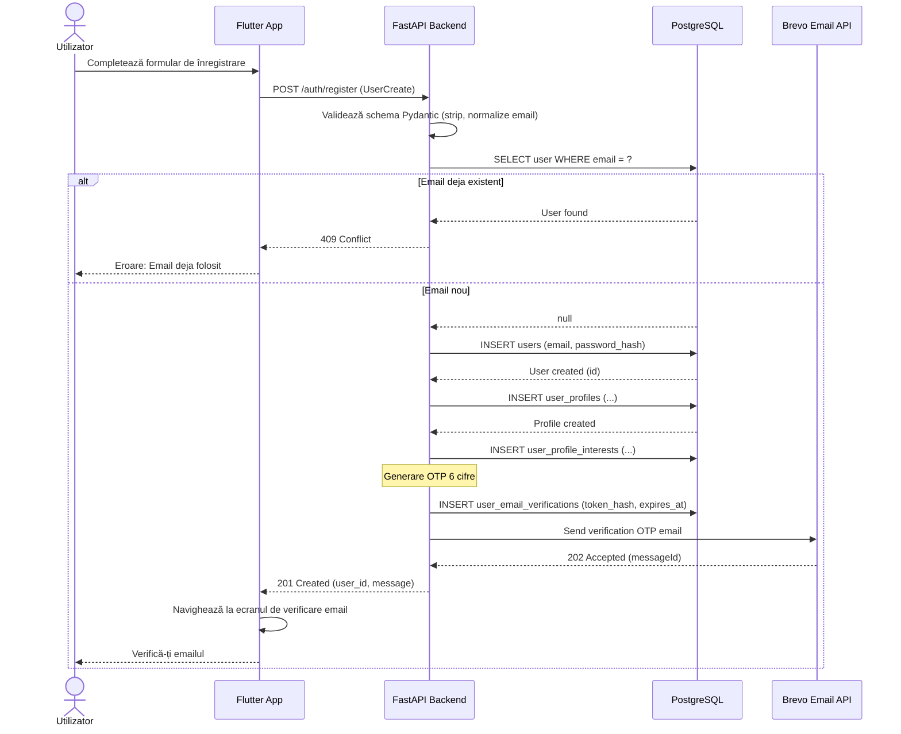
```mermaid
sequenceDiagram
    actor U as Utilizator
    participant App as Flutter App
    participant API as FastAPI Backend
    participant DB as PostgreSQL
    participant Email as Brevo Email API

    U->>App: Completează formular de înregistrare
    App->>API: POST /auth/register (UserCreate)
    
    API->>API: Validează schema Pydantic (strip, normalize email)
    
    API->>DB: SELECT user WHERE email = ?
    
    alt Email deja existent
        DB-->>API: User found
        API-->>App: 409 Conflict
        App-->>U: Eroare: Email deja folosit
    else Email nou
        DB-->>API: null
        API->>DB: INSERT users (email, password_hash)
        DB-->>API: User created (id)
        API->>DB: INSERT user_profiles (...)
        DB-->>API: Profile created
        API->>DB: INSERT user_profile_interests (...)
        
        Note over API: Generare OTP 6 cifre
        API->>DB: INSERT user_email_verifications (token_hash, expires_at)
        API->>Email: Send verification OTP email
        Email-->>API: 202 Accepted (messageId)
        
        API-->>App: 201 Created (user_id, message)
        App->>App: Navighează la ecranul de verificare email
        App-->>U: Verifică-ți emailul
    end
```

### 3.2 Flux de Autentificare și Sesiune

> **Ref MDS-8:** Folosim fragmentul `opt` — „similar cu if...then din programare".

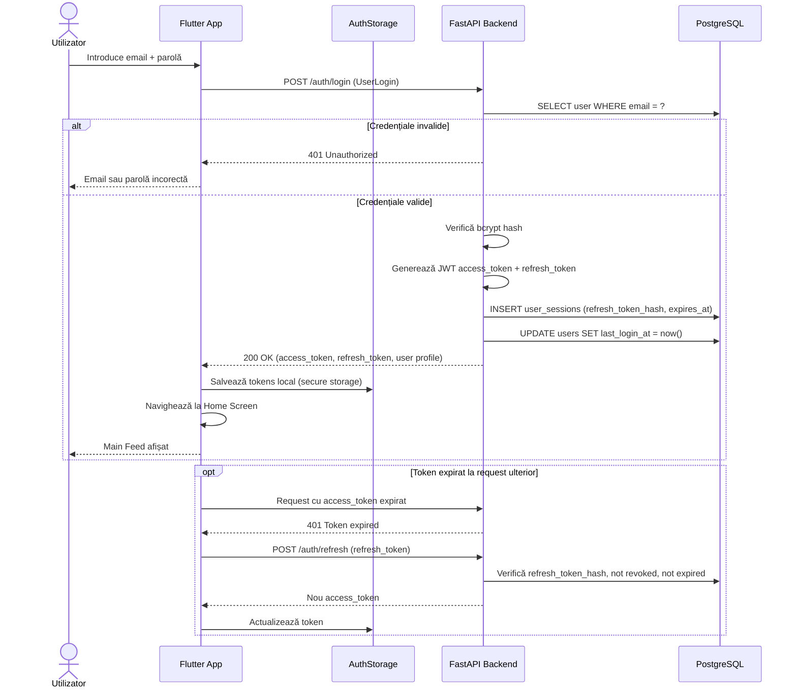
```mermaid
sequenceDiagram
    actor U as Utilizator
    participant App as Flutter App
    participant Store as AuthStorage
    participant API as FastAPI Backend
    participant DB as PostgreSQL

    U->>App: Introduce email + parolă
    App->>API: POST /auth/login (UserLogin)
    
    API->>DB: SELECT user WHERE email = ?
    
    alt Credențiale invalide
        API-->>App: 401 Unauthorized
        App-->>U: Email sau parolă incorectă
    else Credențiale valide
        API->>API: Verifică bcrypt hash
        API->>API: Generează JWT access_token + refresh_token
        API->>DB: INSERT user_sessions (refresh_token_hash, expires_at)
        API->>DB: UPDATE users SET last_login_at = now()
        API-->>App: 200 OK (access_token, refresh_token, user profile)
        App->>Store: Salvează tokens local (secure storage)
        App->>App: Navighează la Home Screen
        App-->>U: Main Feed afișat
    end

    opt Token expirat la request ulterior
        App->>API: Request cu access_token expirat
        API-->>App: 401 Token expired
        App->>API: POST /auth/refresh (refresh_token)
        API->>DB: Verifică refresh_token_hash, not revoked, not expired
        API-->>App: Nou access_token
        App->>Store: Actualizează token
    end
```

### 3.3 Flux Publicare Conținut (Admin)

> **Ref MDS-8:** Mesaje sincrone (linia plină cu vârf), mesaje de răspuns (linia punctată), și fragmente `loop` pentru procesare repetitivă.

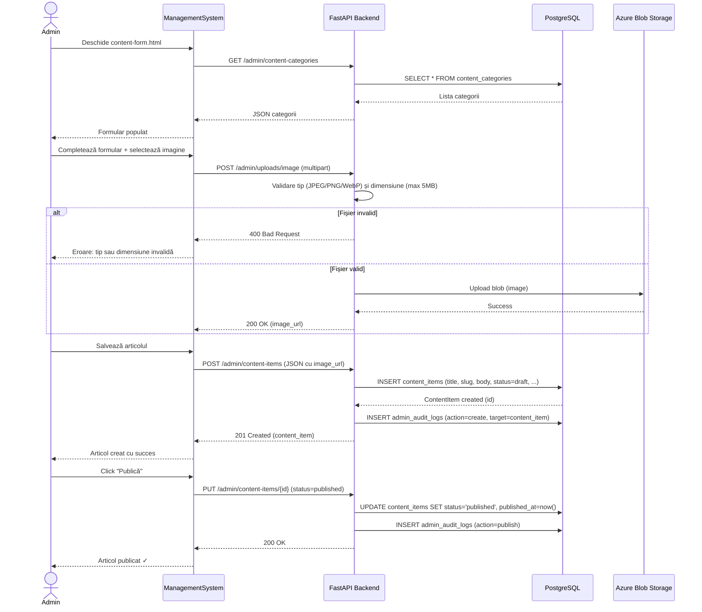
```mermaid
sequenceDiagram
    actor Admin as Admin
    participant MS as ManagementSystem
    participant API as FastAPI Backend
    participant DB as PostgreSQL
    participant Azure as Azure Blob Storage

    Admin->>MS: Deschide content-form.html
    MS->>API: GET /admin/content-categories
    API->>DB: SELECT * FROM content_categories
    DB-->>API: Lista categorii
    API-->>MS: JSON categorii
    MS-->>Admin: Formular populat

    Admin->>MS: Completează formular + selectează imagine
    MS->>API: POST /admin/uploads/image (multipart)
    
    API->>API: Validare tip (JPEG/PNG/WebP) și dimensiune (max 5MB)
    
    alt Fișier invalid
        API-->>MS: 400 Bad Request
        MS-->>Admin: Eroare: tip sau dimensiune invalidă
    else Fișier valid
        API->>Azure: Upload blob (image)
        Azure-->>API: Success
        API-->>MS: 200 OK (image_url)
    end

    Admin->>MS: Salvează articolul
    MS->>API: POST /admin/content-items (JSON cu image_url)
    API->>DB: INSERT content_items (title, slug, body, status=draft, ...)
    DB-->>API: ContentItem created (id)
    API->>DB: INSERT admin_audit_logs (action=create, target=content_item)
    API-->>MS: 201 Created (content_item)
    MS-->>Admin: Articol creat cu succes

    Admin->>MS: Click "Publică"
    MS->>API: PUT /admin/content-items/{id} (status=published)
    API->>DB: UPDATE content_items SET status='published', published_at=now()
    API->>DB: INSERT admin_audit_logs (action=publish)
    API-->>MS: 200 OK
    MS-->>Admin: Articol publicat ✓
```

### 3.4 Flux Înregistrare la Eveniment (cu Plată)

> **Ref MDS-8:** Combinarea fragmentelor `alt` și `opt` pentru a modela fluxul de plată condițional.

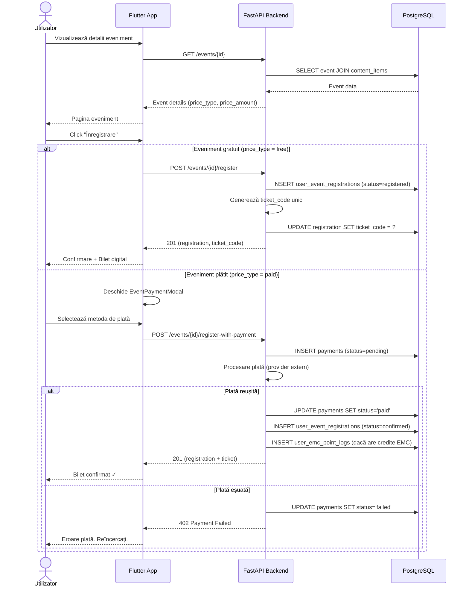
```mermaid
sequenceDiagram
    actor U as Utilizator
    participant App as Flutter App
    participant API as FastAPI Backend
    participant DB as PostgreSQL

    U->>App: Vizualizează detalii eveniment
    App->>API: GET /events/{id}
    API->>DB: SELECT event JOIN content_items
    DB-->>API: Event data
    API-->>App: Event details (price_type, price_amount)
    App-->>U: Pagina eveniment

    U->>App: Click "Înregistrare"
    
    alt Eveniment gratuit (price_type = free)
        App->>API: POST /events/{id}/register
        API->>DB: INSERT user_event_registrations (status=registered)
        API->>API: Generează ticket_code unic
        API->>DB: UPDATE registration SET ticket_code = ?
        API-->>App: 201 (registration, ticket_code)
        App-->>U: Confirmare + Bilet digital
    else Eveniment plătit (price_type = paid)
        App->>App: Deschide EventPaymentModal
        U->>App: Selectează metoda de plată
        App->>API: POST /events/{id}/register-with-payment
        API->>DB: INSERT payments (status=pending)
        API->>API: Procesare plată (provider extern)
        
        alt Plată reușită
            API->>DB: UPDATE payments SET status='paid'
            API->>DB: INSERT user_event_registrations (status=confirmed)
            API->>DB: INSERT user_emc_point_logs (dacă are credite EMC)
            API-->>App: 201 (registration + ticket)
            App-->>U: Bilet confirmat ✓
        else Plată eșuată
            API->>DB: UPDATE payments SET status='failed'
            API-->>App: 402 Payment Failed
            App-->>U: Eroare plată. Reîncercați.
        end
    end
```

### 3.5 Flux Submisie Conținut de Contributor

> **Ref MDS-8:** „Un mesaj poate fi intern (un mesaj nu e neapărat între două obiecte diferite)" — procesarea AI moderare este un mesaj intern al API-ului.

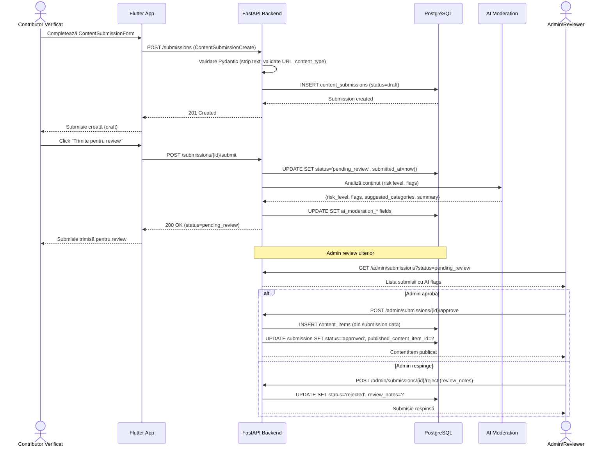
```mermaid
sequenceDiagram
    actor C as Contributor Verificat
    participant App as Flutter App
    participant API as FastAPI Backend
    participant DB as PostgreSQL
    participant AI as AI Moderation

    C->>App: Completează ContentSubmissionForm
    App->>API: POST /submissions (ContentSubmissionCreate)
    API->>API: Validare Pydantic (strip text, validate URL, content_type)
    API->>DB: INSERT content_submissions (status=draft)
    DB-->>API: Submission created
    API-->>App: 201 Created
    App-->>C: Submisie creată (draft)

    C->>App: Click "Trimite pentru review"
    App->>API: POST /submissions/{id}/submit
    API->>DB: UPDATE SET status='pending_review', submitted_at=now()
    
    API->>AI: Analiză conținut (risk level, flags)
    AI-->>API: {risk_level, flags, suggested_categories, summary}
    API->>DB: UPDATE SET ai_moderation_* fields
    
    API-->>App: 200 OK (status=pending_review)
    App-->>C: Submisie trimisă pentru review

    Note over API,DB: Admin review ulterior
    
    actor Admin as Admin/Reviewer
    Admin->>API: GET /admin/submissions?status=pending_review
    API-->>Admin: Lista submisii cu AI flags
    
    alt Admin aprobă
        Admin->>API: POST /admin/submissions/{id}/approve
        API->>DB: INSERT content_items (din submission data)
        API->>DB: UPDATE submission SET status='approved', published_content_item_id=?
        API-->>Admin: ContentItem publicat
    else Admin respinge
        Admin->>API: POST /admin/submissions/{id}/reject (review_notes)
        API->>DB: UPDATE SET status='rejected', review_notes=?
        API-->>Admin: Submisie respinsă
    end
```

---

## 4. Diagrame de Stări (State Diagrams)

> **Ref MDS-9:** „Diagramele de stare descriu dependența dintre starea unui obiect și mesajele pe care le primește." Elementele: stări (dreptunghiuri rotunjite), tranziții (săgeți), evenimente care declanșează tranziții, semnul de început (disc negru), semn de sfârșit (disc negru cu cerc exterior).

### 4.1 Mașina de Stări — ContentItem

> **Ref MDS-9:** „O stare este o mulțime de configurații ale obiectului care se comportă la fel la apariția unui eveniment. O stare poate fi identificată prin constrângeri aplicate atributelor obiectului."
>
> **Constrângeri:** Draft: `{status = 'draft'}`, InReview: `{status = 'in_review'}`, Published: `{status = 'published'}`, Archived: `{status = 'archived'}`

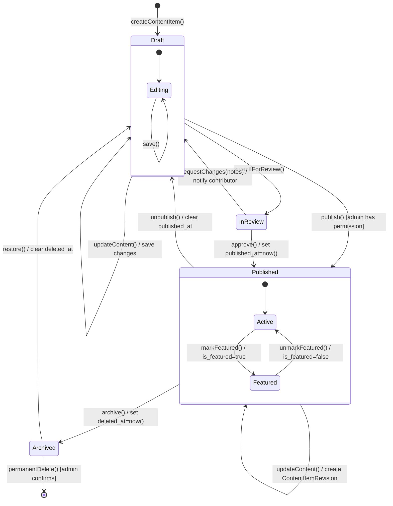
```mermaid
stateDiagram-v2
    [*] --> Draft : createContentItem()

    Draft --> InReview : submitForReview()
    Draft --> Published : publish() [admin has permission]
    Draft --> Draft : updateContent() / save changes

    InReview --> Published : approve() / set published_at=now()
    InReview --> Draft : requestChanges(notes) / notify contributor

    Published --> Archived : archive() / set deleted_at=now()
    Published --> Published : updateContent() / create ContentItemRevision
    Published --> Draft : unpublish() / clear published_at

    Archived --> Draft : restore() / clear deleted_at
    Archived --> [*] : permanentDelete() [admin confirms]

    state Draft {
        [*] --> Editing
        Editing --> Editing : save()
    }

    state Published {
        [*] --> Active
        Active --> Featured : markFeatured() / is_featured=true
        Featured --> Active : unmarkFeatured() / is_featured=false
    }
```

### 4.2 Mașina de Stări — Ad (Reclamă)

> **Ref MDS-9:** „Gărzi: un eveniment declanșează o tranziție numai dacă atributele obiectului îndeplinesc o anumită condiție suplimentară." Reprezentare: `eveniment [gardă] / acțiune`

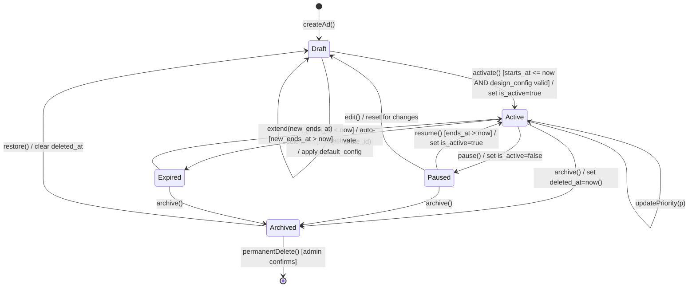
```mermaid
stateDiagram-v2
    [*] --> Draft : createAd()

    Draft --> Active : activate() [starts_at <= now AND design_config valid] / set is_active=true
    Draft --> Draft : updateDesign() / save design_config
    Draft --> Draft : selectTemplate(template_id) / apply default_config

    Active --> Paused : pause() / set is_active=false
    Active --> Archived : archive() / set deleted_at=now()
    Active --> Active : updatePriority(p)
    Active --> Expired : [ends_at < now] / auto-deactivate

    Paused --> Active : resume() [ends_at > now] / set is_active=true
    Paused --> Archived : archive()
    Paused --> Draft : edit() / reset for changes

    Expired --> Archived : archive()
    Expired --> Active : extend(new_ends_at) [new_ends_at > now]

    Archived --> [*] : permanentDelete() [admin confirms]
    Archived --> Draft : restore() / clear deleted_at
```

### 4.3 Mașina de Stări — UserSubscription

> **Ref MDS-9:** Combinație de evenimente temporale (expirare) și acțiuni utilizator (cancel, renew) cu gărzi (verificare plată).

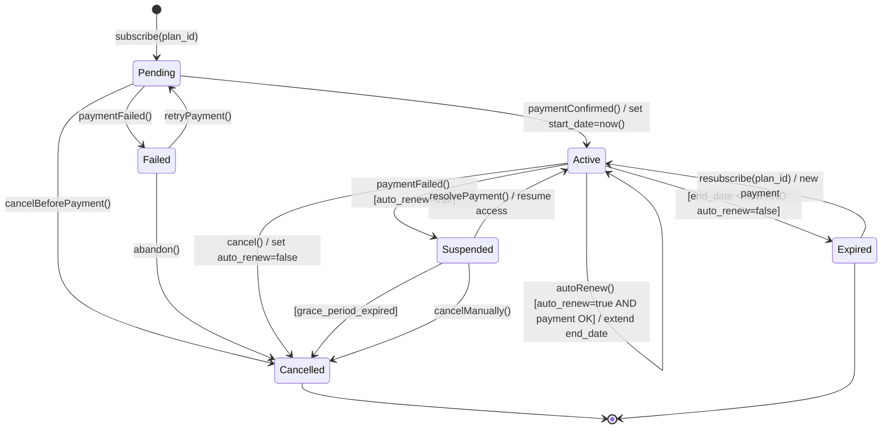
```mermaid
stateDiagram-v2
    [*] --> Pending : subscribe(plan_id)

    Pending --> Active : paymentConfirmed() / set start_date=now()
    Pending --> Cancelled : cancelBeforePayment()
    Pending --> Failed : paymentFailed()

    Failed --> Pending : retryPayment()
    Failed --> Cancelled : abandon()

    Active --> Expired : [end_date < now AND auto_renew=false]
    Active --> Active : autoRenew() [auto_renew=true AND payment OK] / extend end_date
    Active --> Suspended : paymentFailed() [auto_renew=true]
    Active --> Cancelled : cancel() / set auto_renew=false

    Suspended --> Active : resolvePayment() / resume access
    Suspended --> Cancelled : [grace_period_expired]
    Suspended --> Cancelled : cancelManually()

    Expired --> Active : resubscribe(plan_id) / new payment
    Cancelled --> [*]
    Expired --> [*]
```

### 4.4 Mașina de Stări — UserEventRegistration

> **Ref MDS-9:** „Evenimente și acțiuni: un eveniment este ceva care se produce asupra unui obiect; o acțiune reprezintă ceva care poate fi făcut de către obiect."

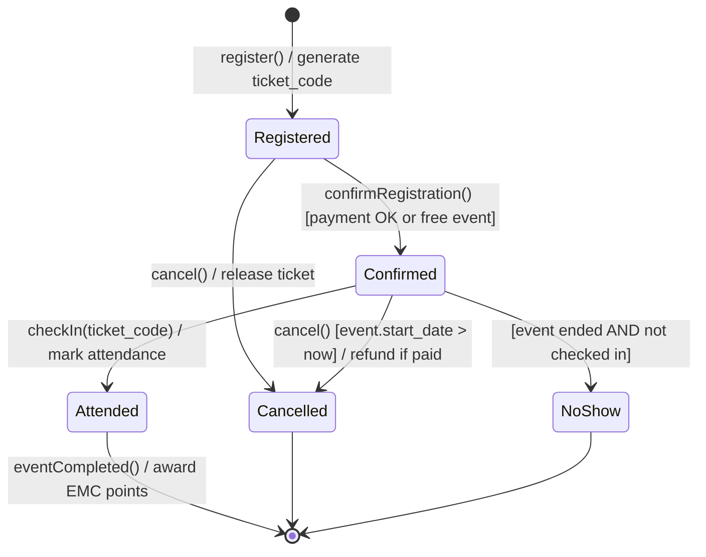
```mermaid
stateDiagram-v2
    [*] --> Registered : register() / generate ticket_code

    Registered --> Confirmed : confirmRegistration() [payment OK or free event]
    Registered --> Cancelled : cancel() / release ticket

    Confirmed --> Attended : checkIn(ticket_code) / mark attendance
    Confirmed --> Cancelled : cancel() [event.start_date > now] / refund if paid
    Confirmed --> NoShow : [event ended AND not checked in]

    Attended --> [*] : eventCompleted() / award EMC points

    Cancelled --> [*]
    NoShow --> [*]
```

### 4.5 Mașina de Stări — ContentSubmission

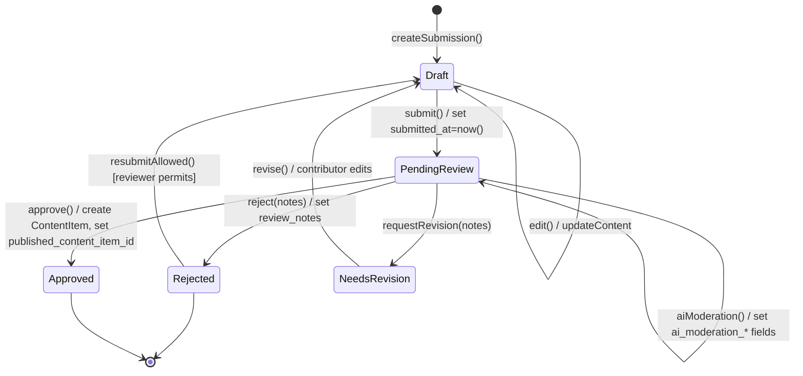
```mermaid
stateDiagram-v2
    [*] --> Draft : createSubmission()

    Draft --> Draft : edit() / updateContent
    Draft --> PendingReview : submit() / set submitted_at=now()

    PendingReview --> PendingReview : aiModeration() / set ai_moderation_* fields
    PendingReview --> Approved : approve() / create ContentItem, set published_content_item_id
    PendingReview --> Rejected : reject(notes) / set review_notes
    PendingReview --> NeedsRevision : requestRevision(notes)

    NeedsRevision --> Draft : revise() / contributor edits
    
    Rejected --> Draft : resubmitAllowed() [reviewer permits]
    Rejected --> [*]

    Approved --> [*]
```

---

## 5. Diagrama Arhitecturii Componentelor (Component/Deployment Diagram)

> **Ref MDS-5:** UML definește 14 tipuri de diagrame, inclusiv diagrame de componente și de deployment pentru vizualizarea arhitecturii fizice.

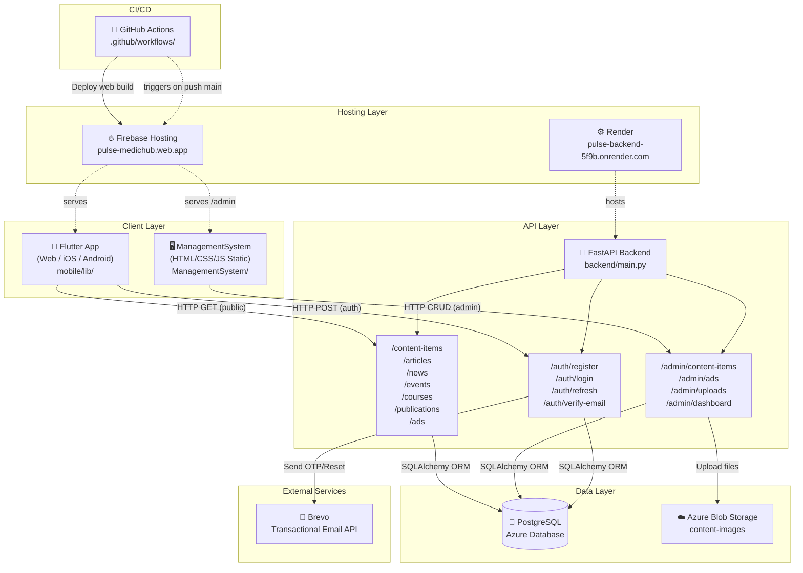
```mermaid
graph TB
    subgraph "Client Layer"
        FLUTTER["📱 Flutter App\n(Web / iOS / Android)\nmobile/lib/"]
        ADMIN["🖥️ ManagementSystem\n(HTML/CSS/JS Static)\nManagementSystem/"]
    end

    subgraph "Hosting Layer"
        FIREBASE["🔥 Firebase Hosting\npulse-medichub.web.app"]
        RENDER["⚙️ Render\npulse-backend-5f9b.onrender.com"]
    end

    subgraph "API Layer"
        FASTAPI["🐍 FastAPI Backend\nbackend/main.py"]
        PUBLIC_API["/content-items\n/articles\n/news\n/events\n/courses\n/publications\n/ads"]
        ADMIN_API["/admin/content-items\n/admin/ads\n/admin/uploads\n/admin/dashboard"]
        AUTH_API["/auth/register\n/auth/login\n/auth/refresh\n/auth/verify-email"]
    end

    subgraph "Data Layer"
        POSTGRES[("🐘 PostgreSQL\nAzure Database")]
        BLOB["☁️ Azure Blob Storage\ncontent-images"]
    end

    subgraph "External Services"
        BREVO["📧 Brevo\nTransactional Email API"]
    end

    subgraph "CI/CD"
        GITHUB["🔄 GitHub Actions\n.github/workflows/"]
    end

    FLUTTER -->|"HTTP GET (public)"| PUBLIC_API
    FLUTTER -->|"HTTP POST (auth)"| AUTH_API
    ADMIN -->|"HTTP CRUD (admin)"| ADMIN_API
    
    FIREBASE -.->|"serves"| FLUTTER
    FIREBASE -.->|"serves /admin"| ADMIN
    RENDER -.->|"hosts"| FASTAPI

    FASTAPI --> PUBLIC_API
    FASTAPI --> ADMIN_API
    FASTAPI --> AUTH_API

    PUBLIC_API -->|"SQLAlchemy ORM"| POSTGRES
    ADMIN_API -->|"SQLAlchemy ORM"| POSTGRES
    AUTH_API -->|"SQLAlchemy ORM"| POSTGRES
    ADMIN_API -->|"Upload files"| BLOB
    AUTH_API -->|"Send OTP/Reset"| BREVO

    GITHUB -->|"Deploy web build"| FIREBASE
    GITHUB -.->|"triggers on push main"| FIREBASE
```

---

## 6. Enumerări (din MDS-7 — Tipuri de Date)

> **Ref MDS-7:** „Pentru fiecare atribut trebuie specificat tipul; tipurile folosite pot fi tipuri de bază sau clase." Enumerările sunt reprezentate ca clase cu stereotipul `«enumeration»`.

```mermaid
classDiagram
    class ContentItemType {
        <<enumeration>>
        article
        news
        course
        event
        publication
    }

    class ContentStatus {
        <<enumeration>>
        draft
        in_review
        published
        archived
    }

    class AdStatus {
        <<enumeration>>
        draft
        active
        paused
        archived
    }

    class AdPlacement {
        <<enumeration>>
        home_top
        home_between_sections
        home_after_news
        home_after_publications
        home_after_events
        home_after_courses
        news_feed
        publications_feed
        events_feed
        courses_feed
        article_detail
        publication_detail
        event_detail
        course_detail
    }

    class AttendanceMode {
        <<enumeration>>
        onsite
        online
        hybrid
    }

    class PriceType {
        <<enumeration>>
        free
        paid
        subscription
    }

    class RegistrationStatus {
        <<enumeration>>
        registered
        confirmed
        attended
        cancelled
        no_show
    }

    class SubscriptionStatus {
        <<enumeration>>
        pending
        active
        expired
        cancelled
        suspended
    }

    class PaymentStatus {
        <<enumeration>>
        pending
        paid
        failed
        refunded
        cancelled
    }

    class LessonContentType {
        <<enumeration>>
        video
        article
        quiz
        pdf
        external_link
    }

    class CourseStatus {
        <<enumeration>>
        draft
        published
        archived
        closed
    }

    class UserCourseStatus {
        <<enumeration>>
        enrolled
        in_progress
        completed
        cancelled
    }
```

---

## Sumar Diagrame

| # | Tip Diagramă | Ref PDF | Secțiune |
|---|---|---|---|
| 1.1 | Use Case — Utilizator | MDS-6 | Actori, `«include»`, `«extend»` |
| 1.2 | Use Case — Admin | MDS-6 | Actori, `«include»`, `«extend»` |
| 2.1 | Clase — Content Domain | MDS-7 | Compunere, asocieri, multiplicități |
| 2.2 | Clase — Events | MDS-7 | Compunere, agregare |
| 2.3 | Clase — Courses | MDS-7 | Compunere ierarhică |
| 2.4 | Clase — Users | MDS-7 | Asocieri, sesiuni |
| 2.5 | Clase — Ads | MDS-7 | Dependențe, template pattern |
| 2.6 | Clase — Subscriptions | MDS-7 | Asocieri, multiplicități |
| 2.7 | Package Diagram | MDS-7 | Pachete, organizare |
| 3.1 | Secvență — Înregistrare | MDS-8 | `alt`, mesaje sincrone, creare obiect |
| 3.2 | Secvență — Autentificare | MDS-8 | `alt`, `opt` |
| 3.3 | Secvență — Publicare conținut | MDS-8 | Mesaje sincrone/asincrone |
| 3.4 | Secvență — Înregistrare eveniment | MDS-8 | `alt` imbricat, plată |
| 3.5 | Secvență — Submisie contributor | MDS-8 | Mesaj intern, AI moderation |
| 4.1 | Stări — ContentItem | MDS-9 | Stări, tranziții, gărzi, sub-stări |
| 4.2 | Stări — Ad | MDS-9 | Gărzi, evenimente temporale |
| 4.3 | Stări — UserSubscription | MDS-9 | Auto-renew, gărzi |
| 4.4 | Stări — EventRegistration | MDS-9 | Evenimente, acțiuni |
| 4.5 | Stări — ContentSubmission | MDS-9 | Workflow review |
| 5 | Arhitectură Componente | MDS-5 | Deployment, componente |
| 6 | Enumerări | MDS-7 | `«enumeration»` stereotype |
